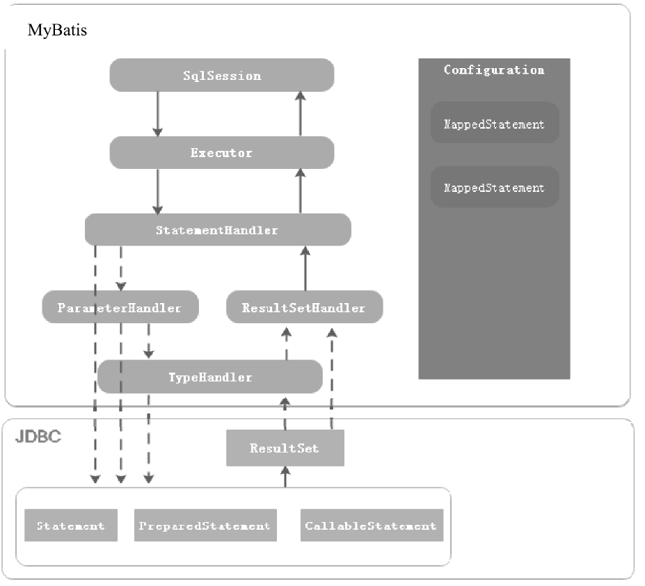
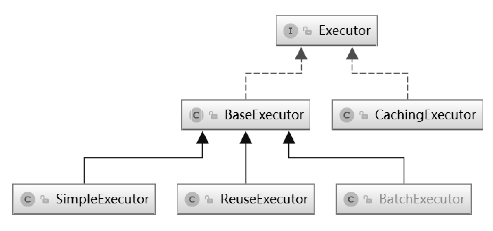
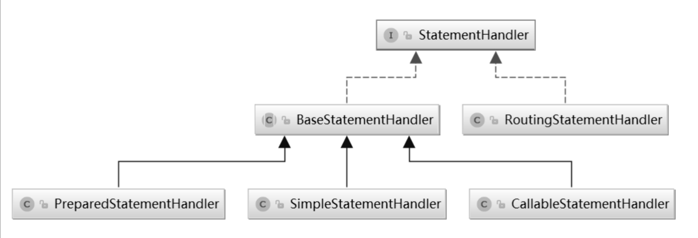

## 三、MyBatis 核心组件

### 1.MyBatis 操作数据库示例

```java
public void testSqlSessionFactory() throws IOException {
    // 1. 从SqlSessionFactory中获取SqlSession
    SqlSessionFactory sqlSessionFactory = new SqlSessionFactoryBuilder().build(Resources.getResourceAsReader("mybatis-config-datasource.xml"));
    SqlSession sqlSession = sqlSessionFactory.openSession();

    // 2. 获取映射器对象
    IUserDao userDao = sqlSession.getMapper(IUserDao.class);

    // 3. 测试验证
    User user = userDao.queryUserInfoById(1L);
    logger.info("测试结果：{}", JSON.toJSONString(user));
}
```

### 2.各组件之间的关系



### 3.SqlSession

SqlSession 是 MyBatis 中提供的与数据库交互的接口，SqlSession 实例通过工厂模式创建。而 SqlSession 的创建又依赖于 SqlSessionFactory，SqlSessionFactory 的创建又依赖于 SqlSessionFactoryBuilder 类。SqlSession 是 MyBatis 提供的面向用户的操作数据库 API。

### 4.Configuration

Configuration 用于描述 MyBatis 的主配置信息，其他组件需要获取配置信息时，直接通过 Configuration 对象获取。除此之外，MyBatis 在应用启动时，将 Mapper 配置信息、类型别名、TypeHandler 等注册到 Configuration 组件中，其他组件需要这些信息时，也可以从 Configuration 对象中获取。也就是说 Configuration 是 MyBatis 中各组件之间相互连接的纽带。

MyBatis 框架的配置信息有两种，一种是配置 MyBatis 框架属性的主配置文件；另一种是配置执行 SQL 语句的 Mapper 配置文件。Configuration 的作用是描述MyBatis主配置文件的信息。

Configuration 存储了各种属性控制 MyBatis 的行为，如：cacheEnabled、lazyLoadingEnabled、useGeneratedKeys 等，同时还作为容器存放 TypeHandler（类型处理器）、TypeAlias（类型别名）、Mapper 接口及 Mapper SQL 配置信息。这些信息在 MyBatis 框架启动时注册到 Configuration 组件中。

### 5.Executor

SqlSession 是 MyBatis 提供给用户的操作数据库的 API，而 Executor 才是 MyBatis 真正的 SQL 执行器，MyBatis 中对数据库所有的增删改查操作都是由 Executor 组件完成的。

MyBatis 提供了3种不同的 Executor，分别为 SimpleExecutor、ResueExecutor、BatchExecutor，这些 Executor 都继承至BaseExecutor，BaseExecutor 中定义的方法的执行流程及通用的处理逻辑，具体的方法由子类来实现，是典型的模板方法模式的应用。

SimpleExecutor 是基础的 Executor，能够完成基本的增删改查操作，ResueExecutor 对 JDBC 中的Statement 对象做了缓存，当执行相同的 SQL 语句时，直接从缓存中取出 Statement 对象进行复用，避免了频繁创建和销毁 Statement 对象，从而提升系统性能，这是享元思想的应用。

BatchExecutor 则会对调用同一个 Mapper 执行的 update、insert 和 delete 操作，调用 Statement 对象的批量操作功能。

当 MyBatis 开启了二级缓存功能时，CachingExecutor 会使用对 SimpleExecutor、ResueExecutor、BatchExecutor 进行装饰，为查询操作增加二级缓存功能，这是装饰器模式的应用。



### 6.MappedStatement

MappedStatement 用于描述 Mapper 中的 SQL 配置信息，是对 Mapper XML 配置文件中<select|update|delete|insert>等标签或者@Select/@Update 等注解配置信息的封装。

### 7.StatementHandler

StatementHandler 组件封装了对 JDBC Statement 的操作，例如设置 Statement 对象的 fetchSize 属性、设置查询超时时间、调用 JDBC Statement 与数据库交互等。

BaseStatementHandler 是一个抽象类，封装了通用的处理逻辑及方法执行流程，具体方法的实现由子类完成，这里使用到了设计模式中的模板方法模式。SimpleStatementHandler 继承至 BaseStatementHandler，封装了对 JDBC Statement对象的操作，PreparedStatementHandler 封装了对 JDBC PreparedStatement 对象的操作，而 CallableStatementHandler则封装了对 JDBC CallableStatement 对象的操作。RoutingStatementHandler 会根据 Mapper 配置中的 statementType 属性（取值为 STATEMENT、PREPARED 或 CALLABLE）创建对应的 StatementHandler 实现。



### 8.TypeHandler

TypeHandler 的作用是解决 JDBC 类型与 Java 类型之间的转换。MyBatis 通过 TypeHandlerRegistry 建立 JDBC 类型、Java 类型与 TypeHandler 之间的映射关系。在 TypeHandlerRegistry 的构造方法中就注册了许多 TypeHandler。

### 9.ParameterHandler

当使用 PreparedStatement 或者 CallableStatement 对象时，如果 SQL 语句中有参数占位符，在执行 SQL 语句之前，就需要为参数占位符设置值。ParameterHandler 的作用是在 PreparedStatementHandler 和 CallableStatementHandler 操作对应的 Statement 执行数据库交互之前为参数占位符设置值。

### 10.ResultSetHandler

ResultSetHandler 用于在 StatementHandler 对象执行完查询操作或存储过程后，对结果集或存储过程的执行结果进行处理。
