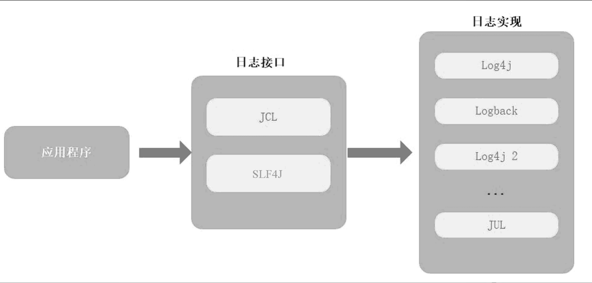
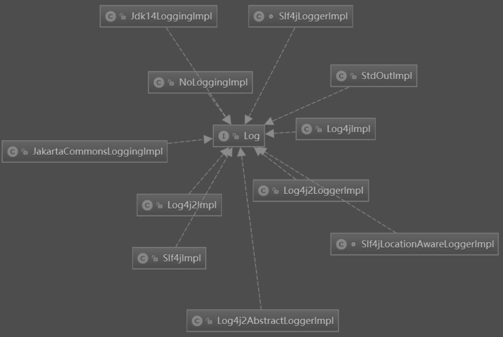

## 七、MyBatis 日志体系

### 1.Java 日志体系

Java 中常见的日志框架：Log4j、Log4j 2、Commons Logging、SLF4J、Logback、JUL

Java 日志领域被划分为两大阵营：Commons Logging 阵营和 SLF4J 阵营。

Commons Logging 和 SLF4J 都是日志门面的实现。

它们之间的关系：



JCL 和 SLF4J 属于日志接口，提供统一的日志操作规范，输入日志功能由具体的日志实现框架（例如 Log4j、Logback 等）完成。

### 2.MyBatis 日志实现

MyBatis 通过 Log 接口定义日志操作规范。

```java
public interface Log {

    boolean isDebugEnabled();

    boolean isTraceEnabled();

    void error(String s, Throwable e);

    void error(String s);

    void debug(String s);

    void trace(String s);

    void warn(String s);

}
```

MyBatis 针对不同的日志框架提供对 Log 接口对应的实现，Log 接口的实现类如图。



Apache Commons Logging：使用 JCL 输出日志。

Log4j 2：使用Log4j 2框架输入日志。

Java Util Logging：使用 JDK 内置的日志模块输出日志。

Log4j：使用 Log4j 框架输出日志。

No Logging：不输出任何日志。

SLF4J：使用 SLF4J 日志门面输出日志。

Stdout：将日志输出到标准输出设备（例如控制台）。

查看一下 Log4jImpl 的代码：

```java
public class Log4jImpl implements Log {

    private static final String FQCN = org.apache.ibatis.logging.log4j.Log4jImpl.class.getName();

    private final Logger log;

    public Log4jImpl(String clazz) {
        log = Logger.getLogger(clazz);
    }

    @Override
    public boolean isDebugEnabled() {
        return log.isDebugEnabled();
    }

    @Override
    public boolean isTraceEnabled() {
        return log.isTraceEnabled();
    }

    @Override
    public void error(String s, Throwable e) {
        log.log(FQCN, Level.ERROR, s, e);
    }
    
    //......
}
```

在 Log4jImpl 构造方法中，获取 Log4j 框架中的 Logger 对象，然后将日志输出操作委托给 Logger 对象来完成，其他日志实现类逻辑与之类似。

MyBatis 提供了 LogFactory 类来构建 Log 实例。

```java
public final class LogFactory {

    //......
    public static synchronized void useCustomLogging(Class<? extends Log> clazz) {
        setImplementation(clazz);
    }

    public static synchronized void useSlf4jLogging() {
        setImplementation(org.apache.ibatis.logging.slf4j.Slf4jImpl.class);
    }

    public static synchronized void useCommonsLogging() {
        setImplementation(org.apache.ibatis.logging.commons.JakartaCommonsLoggingImpl.class);
    }

    public static synchronized void useLog4JLogging() {
        setImplementation(org.apache.ibatis.logging.log4j.Log4jImpl.class);
    }

    public static synchronized void useLog4J2Logging() {
        setImplementation(org.apache.ibatis.logging.log4j2.Log4j2Impl.class);
    }

    public static synchronized void useJdkLogging() {
        setImplementation(org.apache.ibatis.logging.jdk14.Jdk14LoggingImpl.class);
    }

    public static synchronized void useStdOutLogging() {
        setImplementation(org.apache.ibatis.logging.stdout.StdOutImpl.class);
    }

    public static synchronized void useNoLogging() {
        setImplementation(org.apache.ibatis.logging.nologging.NoLoggingImpl.class);
    }

	//......
    private static void setImplementation(Class<? extends Log> implClass) {
        try {
            // 获取日志实现类的 Constructor 对象
            Constructor<? extends Log> candidate = implClass.getConstructor(String.class);
            // 根据日志实现类创建 Log 实例
            Log log = candidate.newInstance(org.apache.ibatis.logging.LogFactory.class.getName());
            if (log.isDebugEnabled()) {
                log.debug("Logging initialized using '" + implClass + "' adapter.");
            }
            // 记录当前使用的日志实现类的 Constructor 对象
            logConstructor = candidate;
        } catch (Throwable t) {
            throw new LogException("Error setting Log implementation.  Cause: " + t, t);
        }
    }
}
```

代码中的 useXXXXXLogging() 方法就是用来显式地指定特定的 Log 实现来打印日志。在 useXXXXXLogging() 方法中调用的是 setImplementation()，在该方法中，首先获取 MyBatis 日志实现类对应的 Constructor 对象，然后通过 LogFactory 类的 logConstructor 属性记录当前日志实现类的 Constructor 对象。

同时 MyBatis 能够按照顺序查找 Classpath 下的日志框架相关 JAR 包。如果 Classpath 下有对应的日志包，则使用该日志框架打印日志。

```java
static {
    tryImplementation(new Runnable() {
        @Override
        public void run() {
            useSlf4jLogging();
        }
    });
    tryImplementation(new Runnable() {
        @Override
        public void run() {
            useCommonsLogging();
        }
    });
    tryImplementation(new Runnable() {
        @Override
        public void run() {
            useLog4J2Logging();
        }
    });
    tryImplementation(new Runnable() {
        @Override
        public void run() {
            useLog4JLogging();
        }
    });
    tryImplementation(new Runnable() {
        @Override
        public void run() {
            useJdkLogging();
        }
    });
    tryImplementation(new Runnable() {
        @Override
        public void run() {
            useNoLogging();
        }
    });
}
```

在初始化代码块中，调用 LogFactory 类的 tryImplementation() 方法确定日志实现类，tryImplementation() 方法的参数是一个 Runnable 的匿名对象，在 run() 方法中调用 useSLF4JLogging() 等方法指定日志实现类。MyBatis 查找日志框架的顺序为 SLF4J→JCL→Log4j 2→Log4j→JUL→No Logging。如果 Classpath 下不存在任何日志框架，则使用 NoLoggingImpl 日志实现类，即不输出任何日志。

同样也可以在配置文件中指定需要使用的日志框架。

```xml
<settings>
	<setting name="logImpl" value="LOG4J">
</settings>
```

这里的 value 是日志框架的别名，别名是在 Configuration 的构造方法中注册的。

```java
typeAliasRegistry.registerAlias("SLF4J", Slf4jImpl.class);
typeAliasRegistry.registerAlias("COMMONS_LOGGING", JakartaCommonsLoggingImpl.class);
typeAliasRegistry.registerAlias("LOG4J", Log4jImpl.class);
typeAliasRegistry.registerAlias("LOG4J2", Log4j2Impl.class);
typeAliasRegistry.registerAlias("JDK_LOGGING", Jdk14LoggingImpl.class);
typeAliasRegistry.registerAlias("STDOUT_LOGGING", StdOutImpl.class);
typeAliasRegistry.registerAlias("NO_LOGGING", NoLoggingImpl.class);
```

当 MyBatis 框架启动时，解析主配置文件中的 logImpl 参数，然后调用 Configuration 类的 setLogImpl() 方法设置日志实现类。

```java
public void setLogImpl(Class<? extends Log> logImpl) {
    if (logImpl != null) {
		this.logImpl = logImpl;
        LogFactory.useCustomLogging(this.logImpl);
    }
}
```

看到这里就与之前说的 LogFactory 联系起来了，MyBatis 中所有的 Log 实例都是由 LogFactory 创建的，这样就保证了整个系统输出日志使用同一种框架。
