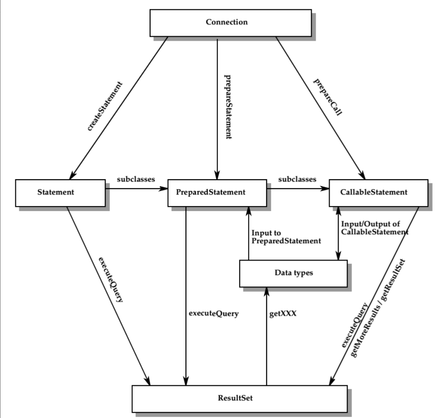
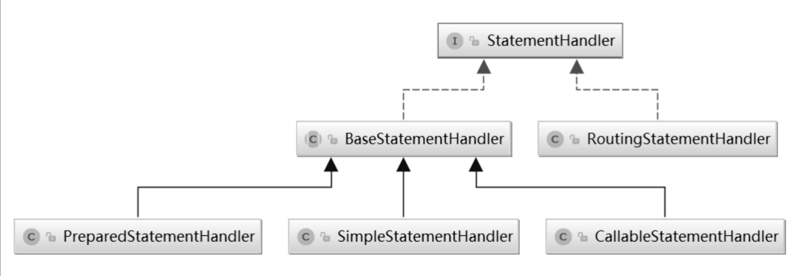

# MyBatis 源码小结

## 一、JDBC 详解

### 1.JDBC 的重要性

MyBatis 框架对 JDBC 做了轻量级的封装，所以要看懂 MyBatis 的源码就必须熟练掌握 JDBC API 的使用。

### 2.什么是 JDBC

JDBC 是 Java 提供的访问关系型数据的接口。JDBC 提供了一种自然的、易于使用的 Java 语言与数据库交互的接口。

使用 JDBC 操作数据源大致需要以下几个步骤：

1）与数据源建立连接

2）执行 SQL 语句

3）检索 SQL 执行结果

4）关闭连接

示例代码：

```java
//1.加载驱动程序
Class.forName("com.mysql.jdbc.Driver");
//2. 获得数据库连接
Connection conn = DriverManager.getConnection(URL, USER, PASSWORD);
//3. 操作数据库，实现增删改查
Statement stmt = conn.createStatement();
ResultSet rs = stmt.executeQuery("SELECT user_name, age FROM user");
//4. 关闭连接
conn.close();
```

### 3.步骤详解

#### 3.1.建立数据源连接

##### DriverManager

在第一次尝试通过 URL 连接数据源时，DriverManager 会自动加载 CLASSPATH 下所有的 JDBC 驱动。DriverManager 提供了一系列重载的 getConnection() 方法来获取 Connection 对象。

```java
Connection conn = DriverManager.getConnection(URL, USER, PASSWORD);
```

##### DataSource

它相比于 DriverManager 更受欢迎，因为它提供了更多底层数据源相关的实现，而且对于应用来说，不需要关注 JDBC 驱动的实现。一个 DataSource 对象的属性被设置后，它就代表一个特定的数据源。需要注意的是，JDBC API 中只提供了DataSource 接口，没有提供 DataSource 的具体实现，DataSource 具体的实现由 JDBC 驱动程序提供。

```java
Connection connection = dataSource.getConnection();
```

#### 3.2.执行 SQL 语句

获取到 JDBC 中的 Connection 对象之后，我们可以通过 Connection 对象设置事务属性，并且可以通过 Connection 接口中提供的方法创建 Statement、PreparedStatement 或者 CallableStatement 对象。

Statement 接口可以理解为 JDBC API 中提供的 SQL 语句的执行器，我们可以调用 Statement 接口中定义的executeQuery() 方法执行查询操作，调用 executeUpdate() 方法执行更新操作，另外还可以调用 executeBatch() 方法执行批量处理。当不知道 SQL 类型的时候也可以直接调用 execute() 方法进行统一的操作。最后通过 Statement 接口提供的getResultSet() 方法来获取查询结果集，或者通过 getUpdateCount() 方法来获取更新操作影响的行数。

#### 3.3.处理 SQL 执行结果

JDBC API 中提供了 ResultSet 接口，该接口的实现类封装 SQL 查询的结果，我们可以对 ResultSet 对象进行遍历，然后通过 ResultSet 提供的一系列 getXXX() 方法（例如 getString）获取查询结果集。

### 4.组件详解

#### 4.1.各组件之间的关系



#### 4.2.Connection

一个 Connection 对象表示通过 JDBC 驱动与数据源建立的连接，这里的数据源可以是关系型数据库管理系统（DBMS）、文件系统或者其他通过 JDBC 驱动访问的数据。使用 JDBC API 的应用程序可能需要维护多个 Connection 对象，一个Connection 对象可能访问多个数据源，也可能访问单个数据源。

从 JDBC 驱动的角度来看，Connection 对象表示客户端会话，因此它需要一些相关的状态信息，例如用户 Id、一组 SQL 语句和会话中使用的结果集以及事务隔离级别等信息。

我们可以通过两种方式获取 JDBC 中的 Connection 对象：（1）通过 JDBC API 中提供的 DriverManager 类获取。（2）通过 DataSource 接口的实现类获取。

使用 DataSource 的具体实现获取 Connection 对象是比较推荐的一种方式，因为它增强了应用程序的可移植性，使代码维护更加容易，并且使应用程序能够透明地使用连接池和处理分布式事务。

#### 4.3.Statement

Statement 接口中定义了执行 SQL 语句的方法，这些方法不支持参数输入，Statement 的主要作用是与数据库进行交互，该接口中定义了一些数据库操作以及检索SQL执行结果相关的方法。

PreparedStatement 继承自 Statement 接口中增加了一些方法，可以为占位符设置值。PreparedStatement 的实例表示可以被预编译的SQL语句，执行一次后，后续多次执行时效率会比较高。使用 PreparedStatement 实例执行 SQL 语句时，可以使用“?”作为参数占位符，然后使用 PreparedStatement 接口中提供的方法为占位符设置参数值。

CallableStatement 接口继承自 PreparedStatement，在此基础上增加了调用存储过程以及检索存储过程调用结果的方法。CallableStatement 接口中新增了一些额外的方法允许参数通过名称注册和检索。

#### 4.4.ResultSet

ResultSet 接口是 JDBC API 中另一个比较重要的组件，提供了检索和操作 SQL 执行结果相关的方法。

ResultSet 对象的类型主要体现在两个方面：（1）游标可操作的方式。（2）ResultSet 对象的修改对数据库的影响。

#### 4.5.DatabaseMetaData

DatabaseMetaData 接口是由 JDBC 驱动程序实现的，用于提供底层数据源相关的信息。该接口主要用于为应用程序或工具确定如何与底层数据源交互。应用程序也可以使用 DatabaseMetaData 接口提供的方法获取数据源信息。

DatabaseMetaData 接口中包含超过150个方法，根据这些方法的类型可以分为以下几类：

1）获取数据源信息。

2）确定数据源是否支持某一特性或功能。

3）获取数据源的限制。

4）确定数据源包含哪些SQL对象以及这些对象的属性。

5）获取数据源对事务的支持。

DatabaseMetaData 对象的创建比较简单，需要依赖 Connection 对象。Connection 对象中提供了一个 getMetadata() 方法，用于创建 DatabaseMetaData 对象。一旦创建了 DatabaseMetaData 对象，我们就可以通过该对象动态地获取数据源相关的信息了。

### 5.JDBC 事务

事务用于提供数据完整性、正确的应用程序语义和并发访问的数据一致性。所有遵循JDBC规范的驱动程序都需要提供事务支持。JDBC 事务主要涉及以下概念：自动提交模式、事务隔离级别、保存点。

#### 5.1.自动提交模式

Connection 对象的 autoCommit 属性决定什么时候结束一个事务。启用自动提交后，会在每个 SQL 语句执行完毕后自动提交事务。当 Connection 对象创建时，默认情况下，事务自动提交是开启的。Connection 接口中提供了一个setAutoCommit() 方法，可以禁用事务自动提交。此时，需要显式地调用 Connection 接口提供 commit() 方法提交事务，或者调用 rollback() 方法回滚事务。禁用事务自动提交适用于需要将多个 SQL 语句作为一个事务提交或者事务由应用服务器管理。

#### 5.2.事务隔离级别

主要的事务隔离级别如下：

1）TRANSACTION_NONE：表示驱动不支持事务，这意味着它是不兼容 JDBC 规范的驱动程序。

2）TRANSACTION_READ_UNCOMMITTED：允许事务读取未提交更改的数据，这意味着可能会出现脏读、不可重复读、幻读等现象。

3）TRANSACTION_READ_COMMITTED：表示在事务中进行的任何数据更改，在提交之前对其他事务是不可见的。这样可以防止脏读，但是不能解决不可重复读和幻读的问题。

4）TRANSACTION_REPEATABLE_READ：该事务隔离级别能够解决脏读和不可重复读问题，但是不能解决幻读问题。

5）TRANSACTION_SERIALIZABLE：该事务隔离级别下，所有事务串行执行，能够有效解决脏读、不可重复读和幻读问题，但是并发效率较低。

Connection 对象的默认事务级别由 JDBC 驱动程序指定。通常它是底层数据源支持的默认事务隔离级别。Connection 接口中提供了一个 setTransactionIsolation() 方法，允许 JDBC 客户端设置 Connection 对象的事务隔离级别。新设置的事务隔离级别会在之后的会话中生效。

#### 5.3.保存点

保存点通过在事务中标记一个中间的点来对事务进行更细粒度的控制，一旦设置保存点，事务就可以回滚到保存点，而不影响保存点之前的操作。DatabaseMetaData 接口提供了 supportsSavepoints() 方法，用于判断 JDBC 驱动是否支持保存点。Connection 接口中提供了 setSavepoint() 方法用于在当前事务中设置保存点，如果 setSavepoint() 方法在事务外调用，则调用该方法后会在 setSavepoint() 方法调用处开启一个新的事务。setSavepoint() 方法的返回值是一个 Savepoint 对象，该对象可作为 Connection 对象 rollback() 方法的参数，用于回滚到对应的保存点。

## 二、MyBatis 常用工具类

## 三、MyBatis 核心组件

### 1.MyBatis 操作数据库示例

```java
public void testSqlSessionFactory() throws IOException {
    // 1. 从SqlSessionFactory中获取SqlSession
    SqlSessionFactory sqlSessionFactory = new SqlSessionFactoryBuilder().build(Resources.getResourceAsReader("mybatis-config-datasource.xml"));
    SqlSession sqlSession = sqlSessionFactory.openSession();

    // 2. 获取映射器对象
    IUserDao userDao = sqlSession.getMapper(IUserDao.class);

    // 3. 测试验证
    User user = userDao.queryUserInfoById(1L);
    logger.info("测试结果：{}", JSON.toJSONString(user));
}
```

### 2.各组件之间的关系


### 3.SqlSession

SqlSession 是 MyBatis 中提供的与数据库交互的接口，SqlSession 实例通过工厂模式创建。而 SqlSession 的创建又依赖于 SqlSessionFactory，SqlSessionFactory 的创建又依赖于 SqlSessionFactoryBuilder 类。SqlSession 是 MyBatis 提供的面向用户的操作数据库 API。

### 4.Configuration

Configuration 用于描述 MyBatis 的主配置信息，其他组件需要获取配置信息时，直接通过 Configuration 对象获取。除此之外，MyBatis 在应用启动时，将 Mapper 配置信息、类型别名、TypeHandler 等注册到 Configuration 组件中，其他组件需要这些信息时，也可以从 Configuration 对象中获取。也就是说 Configuration 是 MyBatis 中各组件之间相互连接的纽带。

MyBatis 框架的配置信息有两种，一种是配置 MyBatis 框架属性的主配置文件；另一种是配置执行 SQL 语句的 Mapper 配置文件。Configuration 的作用是描述MyBatis主配置文件的信息。

Configuration 存储了各种属性控制 MyBatis 的行为，如：cacheEnabled、lazyLoadingEnabled、useGeneratedKeys 等，同时还作为容器存放 TypeHandler（类型处理器）、TypeAlias（类型别名）、Mapper 接口及 Mapper SQL 配置信息。这些信息在 MyBatis 框架启动时注册到 Configuration 组件中。

### 5.Executor

SqlSession 是 MyBatis 提供给用户的操作数据库的 API，而 Executor 才是 MyBatis 真正的 SQL 执行器，MyBatis 中对数据库所有的增删改查操作都是由 Executor 组件完成的。

MyBatis 提供了3种不同的 Executor，分别为 SimpleExecutor、ResueExecutor、BatchExecutor，这些 Executor 都继承至BaseExecutor，BaseExecutor 中定义的方法的执行流程及通用的处理逻辑，具体的方法由子类来实现，是典型的模板方法模式的应用。

SimpleExecutor 是基础的 Executor，能够完成基本的增删改查操作，ResueExecutor 对 JDBC 中的Statement 对象做了缓存，当执行相同的 SQL 语句时，直接从缓存中取出 Statement 对象进行复用，避免了频繁创建和销毁 Statement 对象，从而提升系统性能，这是享元思想的应用。

BatchExecutor 则会对调用同一个 Mapper 执行的 update、insert 和 delete 操作，调用 Statement 对象的批量操作功能。

当 MyBatis 开启了二级缓存功能时，CachingExecutor 会使用对 SimpleExecutor、ResueExecutor、BatchExecutor 进行装饰，为查询操作增加二级缓存功能，这是装饰器模式的应用。


### 6.MappedStatement

MappedStatement 用于描述 Mapper 中的 SQL 配置信息，是对 Mapper XML 配置文件中<select|update|delete|insert>等标签或者@Select/@Update 等注解配置信息的封装。

### 7.StatementHandler

StatementHandler 组件封装了对 JDBC Statement 的操作，例如设置 Statement 对象的 fetchSize 属性、设置查询超时时间、调用 JDBC Statement 与数据库交互等。

BaseStatementHandler 是一个抽象类，封装了通用的处理逻辑及方法执行流程，具体方法的实现由子类完成，这里使用到了设计模式中的模板方法模式。SimpleStatementHandler 继承至 BaseStatementHandler，封装了对 JDBC Statement对象的操作，PreparedStatementHandler 封装了对 JDBC PreparedStatement 对象的操作，而 CallableStatementHandler则封装了对 JDBC CallableStatement 对象的操作。RoutingStatementHandler 会根据 Mapper 配置中的 statementType 属性（取值为 STATEMENT、PREPARED 或 CALLABLE）创建对应的 StatementHandler 实现。



### 8.TypeHandler

TypeHandler 的作用是解决 JDBC 类型与 Java 类型之间的转换。MyBatis 通过 TypeHandlerRegistry 建立 JDBC 类型、Java 类型与 TypeHandler 之间的映射关系。在 TypeHandlerRegistry 的构造方法中就注册了许多 TypeHandler。

### 9.ParameterHandler

当使用 PreparedStatement 或者 CallableStatement 对象时，如果 SQL 语句中有参数占位符，在执行 SQL 语句之前，就需要为参数占位符设置值。ParameterHandler 的作用是在 PreparedStatementHandler 和 CallableStatementHandler 操作对应的 Statement 执行数据库交互之前为参数占位符设置值。

### 10.ResultSetHandler

ResultSetHandler 用于在 StatementHandler 对象执行完查询操作或存储过程后，对结果集或存储过程的执行结果进行处理。

## 四、SqlSession 创建过程

### 1.Configuration 实例创建过程

MyBatis 通过 XMLConfigBuilder 类完成 Configuration 对象的构建工作。

示例代码：

```java
public void testParseConfiguration() throws IOException {
    Reader reader = Resources.getResourceAsReader("mybatis-config-datasource.xml");
    XMLConfigBuilder builder = new XMLConfigBuilder(reader);
    Configuration configuration = builder.parse();
}
```

首先使用 Resources 工具加载配置文件，再将加载好的配置文件作为参数传递到 XMLConfigBuilder 中进行解析。XMLConfigBuilder 采用的是 Xpath 去解析 XML 配置文件，使用的类是 XPathParser。

```java
public Configuration parse() {
    if (parsed) {
        throw new BuilderException("Each XMLConfigBuilder can only be used once.");
    }
    parsed = true;
    // 找到配置文件中的 <configuration> 标签进行解析
    parseConfiguration(parser.evalNode("/configuration"));
    return configuration;
}
```

```java
private void parseConfiguration(XNode root) {
    try {
        //issue #117 read properties first
        propertiesElement(root.evalNode("properties"));
        Properties settings = settingsAsProperties(root.evalNode("settings"));
        loadCustomVfs(settings);
        typeAliasesElement(root.evalNode("typeAliases"));
        pluginElement(root.evalNode("plugins"));
        objectFactoryElement(root.evalNode("objectFactory"));
        objectWrapperFactoryElement(root.evalNode("objectWrapperFactory"));
        reflectorFactoryElement(root.evalNode("reflectorFactory"));
        settingsElement(settings);
        // read it after objectFactory and objectWrapperFactory issue #631
        environmentsElement(root.evalNode("environments"));
        databaseIdProviderElement(root.evalNode("databaseIdProvider"));
        typeHandlerElement(root.evalNode("typeHandlers"));
        mapperElement(root.evalNode("mappers"));
    } catch (Exception e) {
      	throw new BuilderException("Error parsing SQL Mapper Configuration. Cause: " + e, e);
    }
}
```

这里便是根据不同的标签去解析对应的配置信息，并将所有的配置信息存在 Configuration 对象中。

### 2.SqlSession 示例创建过程

代码示例：

```java
public void testSqlSession() throws IOException {
    Reader reader = Resources.getResourceAsReader("mybatis-config-datasource.xml");
    SqlSessionFactory sqlSessionFactory = new SqlSessionFactoryBuilder().build(reader);
    SqlSession sqlSession = sqlSessionFactory.openSession();
}
```

```java
public SqlSessionFactory build(Reader reader, String environment, Properties properties) {
    try {
        XMLConfigBuilder parser = new XMLConfigBuilder(reader, environment, properties);
        return build(parser.parse());
    } catch (Exception e) {
        throw ExceptionFactory.wrapException("Error building SqlSession.", e);
    } finally {
        	ErrorContext.instance().reset();
        try {
        	reader.close();
        } catch (IOException e) {
        // Intentionally ignore. Prefer previous error.
        }
    }
}

public SqlSessionFactory build(Configuration config) {
    return new DefaultSqlSessionFactory(config);
}
```

```java
public class DefaultSqlSessionFactory implements SqlSessionFactory {

  private final Configuration configuration;

    public DefaultSqlSessionFactory(Configuration configuration) {
    	this.configuration = configuration;
    }
}
```

这里先通过 XMLConfigBuilder 解析出配置信息，生成 Configuration，再作为参数传递给 SqlSessionFactoryBuilder#build() 方法构建 SqlSessionFactory。

```java
public SqlSession openSession() {
    return openSessionFromDataSource(configuration.getDefaultExecutorType(), null, false);
}
```

```java
private SqlSession openSessionFromDataSource(ExecutorType execType, TransactionIsolationLevel level, boolean autoCommit) {
Transaction tx = null;
    try {
        // 获取 MyBatis 主配置文件配置的环境信息
        final Environment environment = configuration.getEnvironment();
        // 创建事务管理工厂
        final TransactionFactory transactionFactory = getTransactionFactoryFromEnvironment(environment);
        tx = transactionFactory.newTransaction(environment.getDataSource(), level, autoCommit);
        // 根据主配置文件中指定的 Executor 类型创建对应的 Executor
        final Executor executor = configuration.newExecutor(tx, execType);
        // 创建 DefaultSqlSession
        return new DefaultSqlSession(configuration, executor, autoCommit);
    } catch (Exception e) {
    	closeTransaction(tx); // may have fetched a connection so lets call close()
    	throw ExceptionFactory.wrapException("Error opening session.  Cause: " + e, e);
    } finally {
    	ErrorContext.instance().reset();
    }
}
```

事务管理器对象创建完毕后，接着调用 Configuration#newExecutor() 方法，根据 MyBatis 主配置文件中指定的 Executor 类型创建对应的 Executor 对象，最后以 Executor 对象和 Configuration 对象作为参数，通过 Java 中的 new 关键字创建一个 DefaultSqlSession 对象。DefaultSqlSession 对象中持有 Executor 对象的引用，真正执行 SQL 操作的是 Executor 对象。


